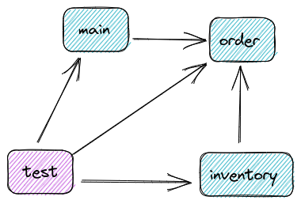

# Kotlin internal visibility with Gradle
Handling Kotlin internal visibility with multiple Gradle sourcesets.

## Motivation
Trying out [modularization](https://en.wikipedia.org/wiki/Modular_programming) in a Spring Boot monolith by using [Kotlin internal visibility modifier](https://kotlinlang.org/docs/visibility-modifiers.html) and multiple sourcesets in [Gradle](https://gradle.org/).

## Implementation

The application is a Spring Boot command line application with four "modules" (Gradle sourcesets):
* `main` is the main starting point of the application.
* `order` has order-specific functionality.
* `inventory` has order-specific functionality.
* `test` unit tests for all other modules.

Module dependencies:



Every module exposes only public classes/funtions/other so internal things are marked `internal`.

### Inspiration
Heavily inspired by an [example from Spring Modulith](https://github.com/spring-projects/spring-modulith/tree/main/spring-modulith-examples/spring-modulith-example-full). :)

### IntelliJ
IntelliJ has [a bug](https://youtrack.jetbrains.com/issue/KTIJ-7662/IDE-support-internal-visibility-introduced-by-associated-compilations) so that tests cannot recognize internal classes/functions/stuff from other sourcesets even if they are configured to do so in Gradle:
```kotlin
```